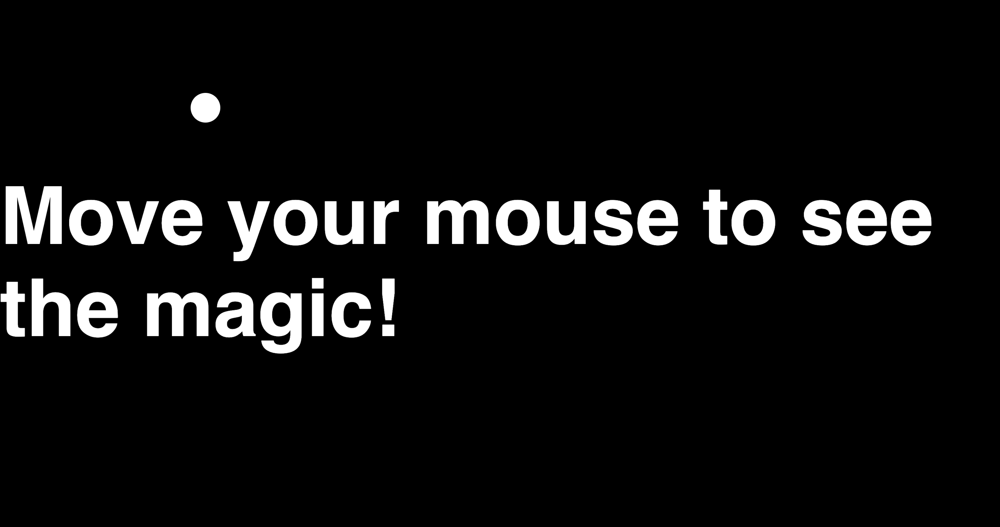

# Dynamic Cursor Tracker

Dynamic Cursor Tracker is a simple web project that demonstrates a custom cursor effect. As you move your mouse across the screen, a circular cursor dynamically follows your movements, creating an engaging visual experience.

## Screenshot

## Features

- **Custom Cursor**: A circular cursor that tracks the mouse movement.
- **Smooth Animation**: The cursor moves smoothly with a transition effect.
- **Responsive Design**: Works seamlessly on different screen sizes.

## Project Structure

The project consists of the following files:

- `index.html`: The main HTML file that contains the structure of the webpage.
- `style.css`: The CSS file that styles the page and defines the appearance of the custom cursor.
- `script.js`: The JavaScript file that implements the cursor tracking logic.

## How It Works

1. The `script.js` file listens for the `mousemove` event on the `.main` container.
2. The cursor's position is updated dynamically based on the mouse's `x` and `y` coordinates.
3. The `style.css` file defines the appearance and animation of the cursor.

## Usage

1. Clone or download this repository.
2. Open `index.html` in any modern web browser.
3. Move your mouse around the screen to see the custom cursor in action.

## Technologies Used

- **HTML**: For the structure of the webpage.
- **CSS**: For styling and animations.
- **JavaScript**: For implementing the cursor tracking logic.

## License

This project is open-source and available under the MIT License.